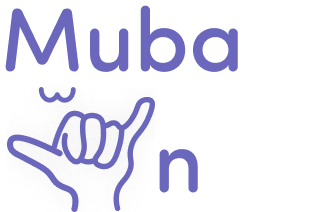

#  Mubayin | مُبيِّــــن  
## **Introduction 🌟** 
**Mubayin**  is a mobile application designed to enhance communication between deaf-mute individuals and the hearing community. Utilizing AI and deep learning, Mubayin offers real-time sign language interpretation and speech-to-text conversion in both Arabic and English. Its goal is to create an inclusive environment where everyone can communicate effortlessly 💜.

## **Technology Stack 🌟** 
- **Programming Language (Backend):** Python 🐍
- **Programming Language (Frontend):** Dart 🎨
- **Framework:** Flutter 📱
- **AI Framework:** TensorFlow ⚙️
- **Gesture Tracking:** MediaPipe ✋
- **Cloud Services:** Google Cloud ☁️
- **Database:** NoSQL 🗄️
- **Real-time Database:** Firebase 🔥
- **Tools:** Visual Studio Code, GitHub, Jira 🛠️
  
## **Launching Instructions 🌟** 
1.  Click the `<> Code` button on this page and choose `Download ZIP`. Extract the contents to a designated folder on your computer.  

2.  Navigate to the extracted folder and open it in your preferred development environment. Ensure you have all necessary dependencies installed.  

3.  Start the app using your local server or the Flutter command line tools.  

## **Instructions for Using the Backend for Hand Landmark Detection:✋**

1- in command line Navigate to the Directory HandModel-backend

2- Install Required Libraries:by runinnig the following command line  {pip install flask mediapipe opencv-python numpy}// note the command is between the {}

3- in the following file lib->pages->video_call_page->video_call_page_widget.dart change the url in line 17 {http://x.x.X.X:3002/upload} to your network 
you can find it by running in command line {ipconfig}-> then take the ipv4 and replace x.x.x.x

4- make sure you preform step 1

5- run the following in cmd {python handModel.py}

6- run flutter app 

 

And there you go! Mubayin should now be up and running on your local machine. Enjoy exploring 💜🌟 !   

